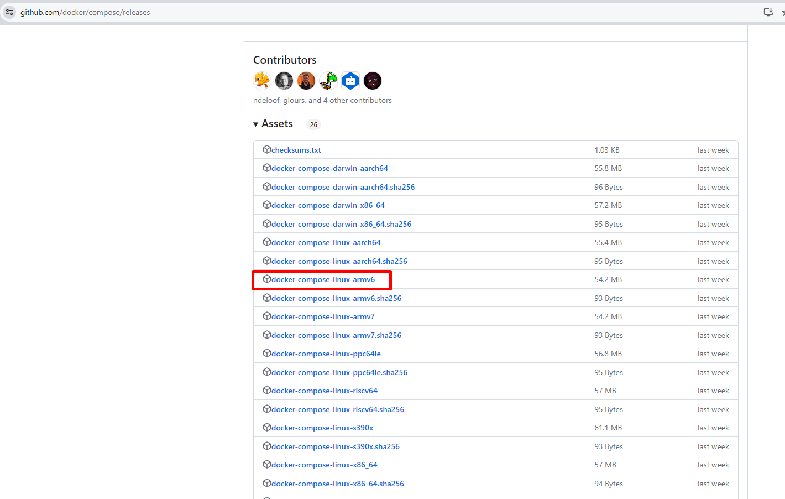

# Docker y Raspberry: Instalar Docker y Docker Compose

---

## Introducción

Este artículo proporciona instrucciones para instalar Docker y Docker Compose en una Raspberry Pi. Estas herramientas son esenciales para probar y poner en producción diversos servicios de forma sencilla.

## Instalar Docker en la Raspberry Pi

Ejecuta la siguiente instrucción en el terminal para instalar Docker:

```bash
curl -sSL https://get.docker.com | sh
```

Añade tu usuario al grupo Docker para evitar ejecutar comandos con derechos de administrador:

```bash
sudo groupadd docker
sudo usermod -aG docker pi
newgrp docker
```

Verifica la instalación ejecutando:

```bash
docker run hello-world
```

## Instalar Docker Compose en la Raspberry Pi

## Instalar Docker Compose con python

```bash
sudo apt install -y libffi-dev libssl-dev python3-pip
sudo pip3 install docker-compose
```

## Instalar Docker Compose bash desde repositorio

Obtener URL de archivo a descargar en "https://github.com/docker/compose/releases"

Descargar la última versión, teniendo en cuenta la salida en tu máquina de los valores de estos comandos:

```bash
uname -s
uname -m
```

En mi caso, la salida es:

```bash
linux
aarch64
```
por lo que me descargo, a día de hoy, esta versión: 

```bash
https://github.com/docker/compose/releases/download/v2.24.0-birthday.10/docker-compose-linux-armv6
```


```bash
sudo curl -L "https://github.com/docker/compose/releases/download/version/distribution/version" -o /usr/local/bin/docker-compose
sudo chmod +x /usr/local/bin/docker-compose
```

## Desinstalar Docker Compose

```bash
sudo pip3 uninstall docker-compose
```

---
Contenido original de: https://atareao.es/como/docker-y-raspberry-instalar-docker-y-docker-compose/